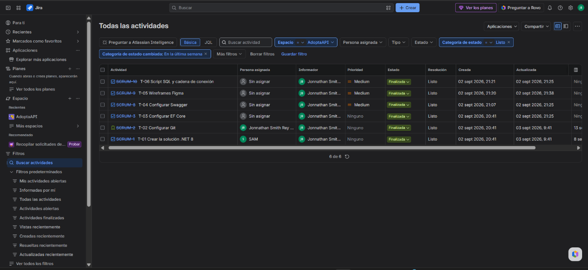
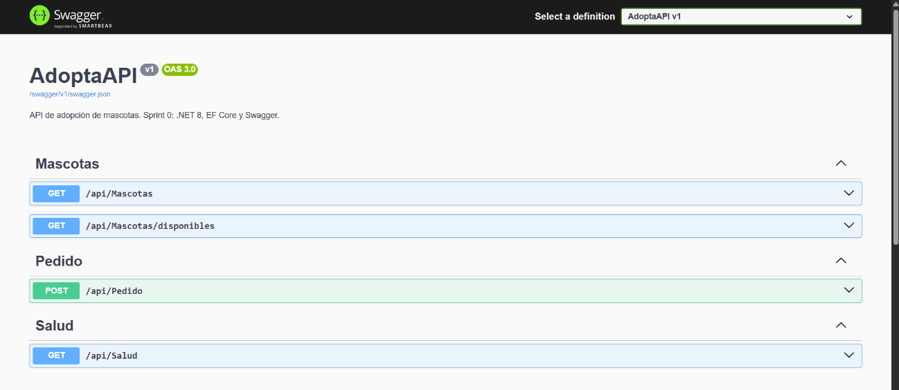
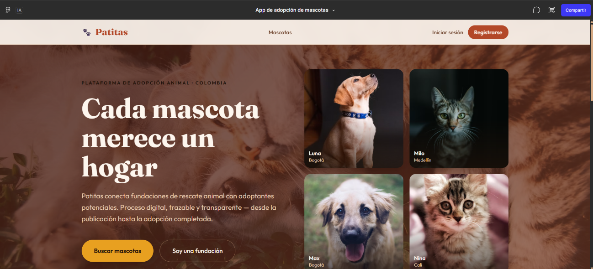
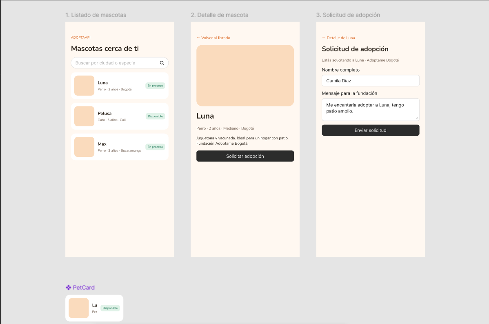

# Evidencias Sprint 0 — Quiz Corte II

Estas capturas y archivos viven en el repositorio **público** [SmithRey/AdoptaAPI](https://github.com/SmithRey/AdoptaAPI).  
Se pueden abrir en el navegador **sin cuenta de GitHub, Jira ni Figma**, y sin tener la API encendida.

## Por qué no bastan los enlaces del documento Word

| Enlace del quiz | ¿El profesor puede abrirlo? | Motivo |
|---|---|---|
| [Jira — tareas Done](https://adoptaapi.atlassian.net/issues/?jql=project%20%3D%20%22SCRUM%22%20AND%20statusCategory%20%3D%20Done%20AND%20statusCategoryChangedDate%20%3E%3D%20-1w) | No | Sin sesión de Atlassian el tablero no muestra las issues del equipo (`project SCRUM` no existe para un visitante). |
| [Swagger local](https://localhost:7133/swagger/index.html) | No | `localhost` solo existe en el PC del estudiante, con la API en ejecución. |
| [Figma Make — app Patitas](https://www.figma.com/make/xcD5ROT9ZUGXGvQNgrjYjW/App-de-adopci%C3%B3n-de-mascotas?code-node-id=0-6&p=f&t=u21PMslhtl3253XC-0&fullscreen=1) | No | Figma pide *Sign up or Log in*. |
| [Figma — wireframes Sprint 0](https://www.figma.com/design/Gn6SYPXgMmL8Bz3ZPRY4D5/AdoptaAPI-%E2%80%94-Wireframes-Sprint-0?node-id=0-1&p=f&t=dJqyGmzWBLNGmLys-0) | No | Figma pide *Sign up or Log in*. |

## Evidencia pública (sí se puede abrir)

| Entregable | Archivo en este repo |
|---|---|
| Jira — T-01 a T-06 en estado Finalizado / Listo | [01-jira-tareas-finalizadas.png](./01-jira-tareas-finalizadas.png) |
| Swagger UI — AdoptaAPI v1 (OAS 3.0) | [02-swagger-adoptaapi.png](./02-swagger-adoptaapi.png) |
| Figma Make — landing *Patitas* | [03-figma-make-patitas.png](./03-figma-make-patitas.png) |
| Figma — wireframes listado / detalle / solicitud | [04-figma-wireframes-sprint0.png](./04-figma-wireframes-sprint0.png) |
| Contrato OpenAPI 3.0 (el mismo de `/swagger/v1/swagger.json`) | [swagger-v1.json](./swagger-v1.json) |

### Jira (T-01 … T-06)

Tareas visibles en la captura: T-01 solución .NET 8, T-02 Git, T-03 EF Core, T-04 Swagger, T-05 wireframes Figma, T-06 script SQL.

### Swagger

Endpoints de AdoptaAPI: `GET /api/Salud`, `GET /api/Mascotas`, `GET /api/Mascotas/disponibles`, `POST /api/Pedido` (solicitud de adopción).

### Figma Make

### Wireframes Sprint 0

